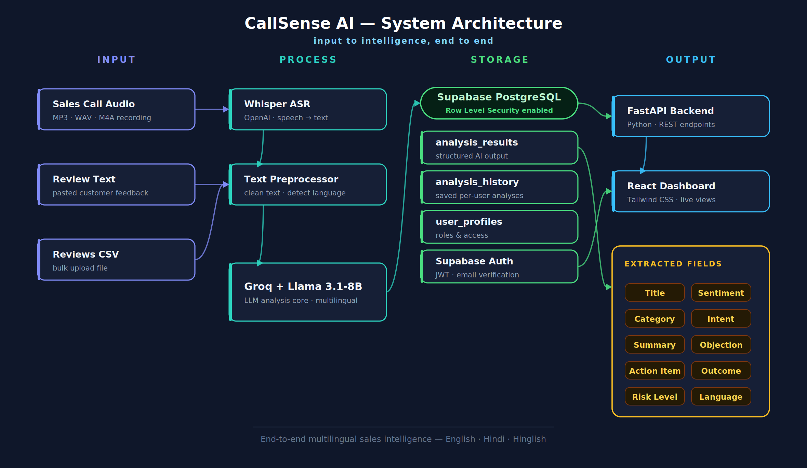
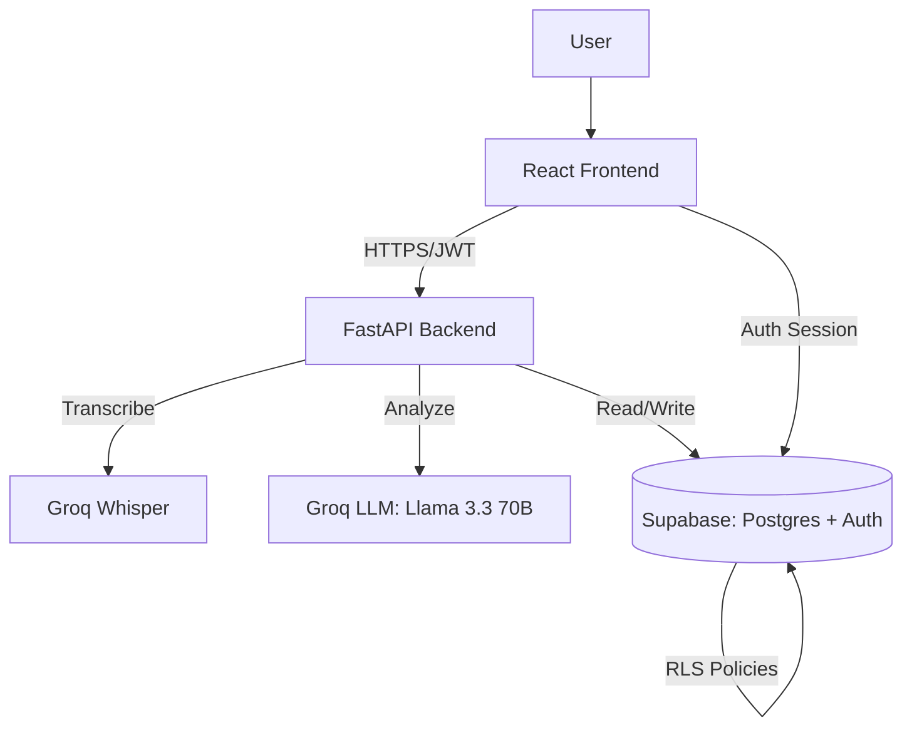
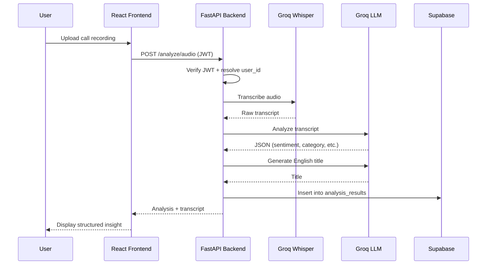
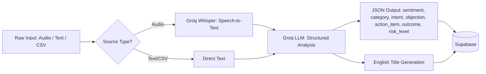
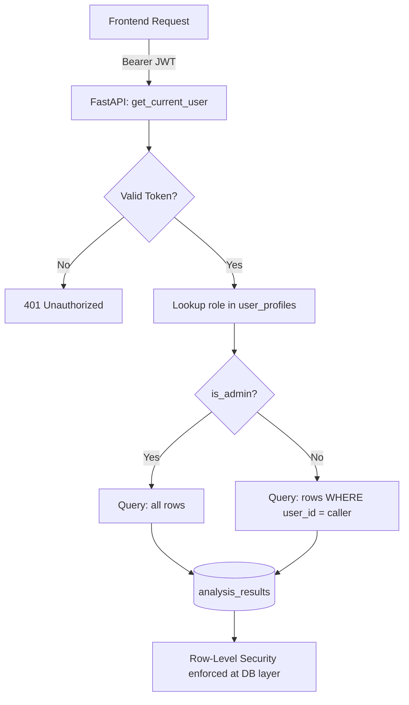
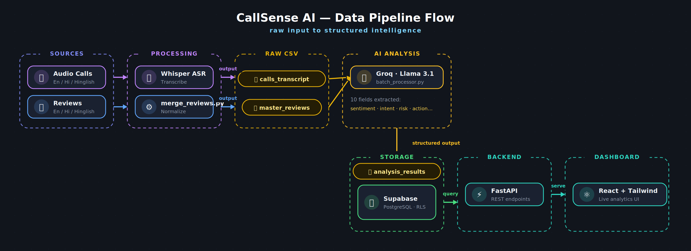
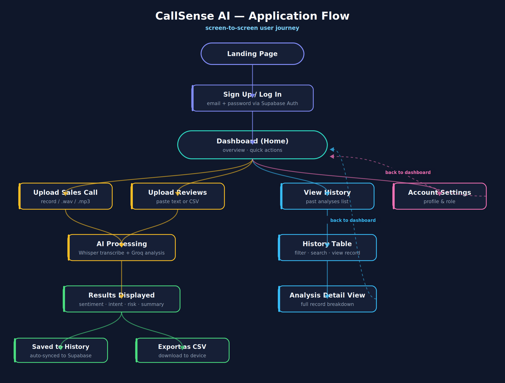
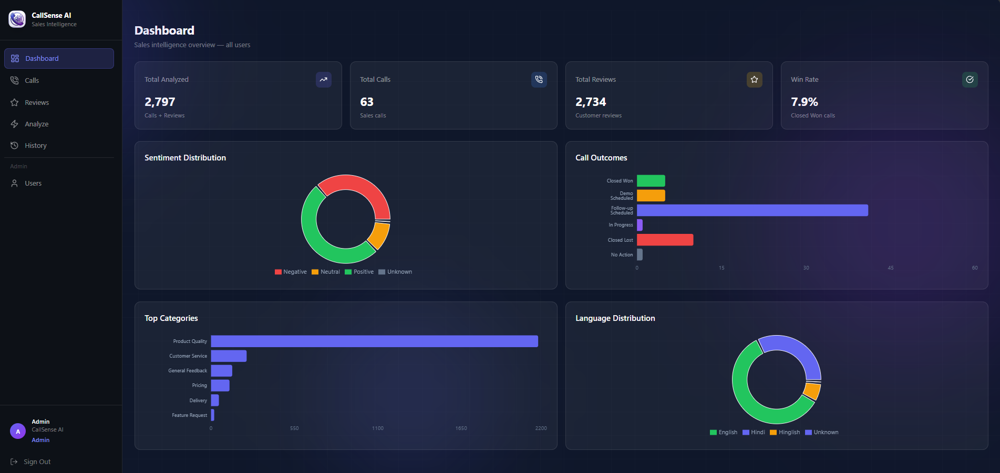
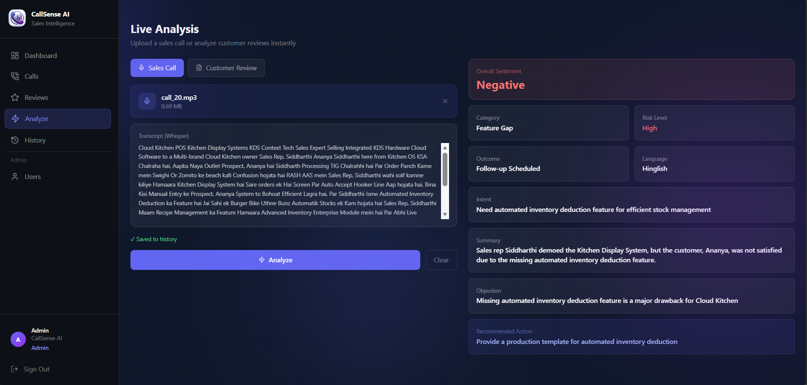

<div align="center">

# 🧠 CallSense AI

### AI-Powered Multilingual Sales Intelligence Platform

Turn every sales call and customer review — in **English, Hindi, or Hinglish** — into structured, actionable business insight.


[🌐 Live Demo](https://callsense-ai-rho.vercel.app/) · [🎥 Demo Video](#-live-demo) · [📖 PPT](https://github.com/AatifaRizvi/CallSense-AI/blob/main/CallSense-AI-Presentation.pptx) · [🐛 Report Bug](https://github.com/AatifaRizvi/CallSense-AI/issues) · [✨ Request Feature](https://github.com/AatifaRizvi/CallSense-AI/issues)

</div>

---

## 🌐 Live Demo

| | |
|---|---|
| 🖥️ **Frontend** | [Live Application](https://callsense-ai-rho.vercel.app/) |
| 🚀 **Backend API** | [API Endpoint](https://callsense-ai-backend.onrender.com) |
| 🎥 **Demo Video** | [Watch Demo](YOUR_YOUTUBE_LINK) |
| 💻 **Source Code** | [GitHub Repository](https://github.com/AatifaRizvi/CallSense-AI) |

---

## 📋 Table of Contents

- [Why CallSense AI?](#-why-callsense-ai)
- [Problem Statement](#-problem-statement)
- [Solution Overview](#-solution-overview)
- [Key Features](#-key-features)
- [System Architecture](#-system-architecture)
- [Example: Input → Output](#-example-input--output)
- [Tech Stack](#-tech-stack)
- [Project Structure](#-project-structure)
- [API Documentation](#-api-documentation)
- [Getting Started](#-getting-started)
- [Environment Variables](#-environment-variables)
- [Screenshots](#-screenshots)
- [Deployment](#-deployment)
- [Performance & Scalability](#-performance--scalability)
- [Security](#-security)
- [Roadmap](#-roadmap)
- [Challenges Faced](#-challenges-faced)
- [Lessons Learned](#-lessons-learned)
- [Skills Demonstrated](#-resume--skills-demonstrated)
- [Business Use Cases](#-business-use-cases)
- [FAQ](#-faq)
- [Author](#-author)
- [License](#-license)

---

## 💡 Why CallSense AI?

Sales teams generate hours of call recordings and thousands of customer reviews every week — but almost none of it gets reviewed at scale. Most existing sales intelligence tools are built **English-first**, which makes them a poor fit for markets where conversations naturally mix languages.

CallSense AI was built to close that gap: a platform that reads a conversation **the way it was actually spoken** — English, Hindi, or Hinglish — and turns it into the same structured insight either way.

## 🎯 Problem Statement

- Sales managers can't manually review every call or review — most feedback goes unread.
- Existing sentiment/intelligence tools assume clean, monolingual English input.
- Multilingual and code-switched conversations (Hindi ↔ English) are either misclassified or ignored entirely by off-the-shelf NLP tools.
- Teams need a fast way to identify **objections, risk, and next actions** without listening to every recording.

## ✅ Solution Overview

CallSense AI accepts a sales call recording, a pasted review, or a bulk CSV of reviews, and runs it through a two-stage AI pipeline:

1. **Groq Whisper (Large v3)** transcribes audio to text (for calls).
2. **Groq (Llama 3.3 70B Versatile)** analyzes the text — regardless of language — and extracts a structured JSON object: title, sentiment, category, intent, summary, objection, action item, outcome, risk level, and detected language.

Every result is persisted per-user in Supabase, with role-based access so admins see team-wide data and individual users see only their own.

---

## ✨ Key Features

<table>
<tr>
<td width="33%">

### 🎙️ Call Intelligence
- Audio upload (MP3/WAV/M4A)
- Groq Whisper transcription
- Automatic sentiment & objection extraction
- Outcome classification

</td>
<td width="33%">

### 🌍 Multilingual Core
- Native English, Hindi & Hinglish support
- No separate model per language
- AI-generated English titles regardless of source language

</td>
<td width="33%">

### 📊 Analytics & Access
- Live dashboard (sentiment, outcome, category, language charts)
- Role-based access (Admin vs. User)
- Full analysis history, CSV export

</td>
</tr>
</table>

| Feature | Description |
|---|---|
| 🎙️ AI Sales Call Analysis | Upload a recording → Groq Whisper transcribes → Groq LLM analyzes |
| ⭐ Customer Review Analysis | Paste text or bulk-upload a CSV |
| 🌍 Multilingual Analysis | English, Hindi, Hinglish — handled natively |
| 🧾 Sentiment Detection | Positive / Negative / Neutral classification |
| 🎯 Intent Extraction | What the customer actually wants |
| ⚠️ Objection Detection | Specific objection raised in the conversation |
| 📈 Outcome Prediction | Closed Won / Lost, Follow-up, Demo Scheduled, etc. |
| 🚨 Risk Analysis | Low / Medium / High risk flagging |
| ✅ Action Item Generation | Concrete next step for the sales rep |
| 🏷️ AI-Generated Titles | Short English headline for every record |
| 📊 Dashboard Analytics | Sentiment, outcome, category, language breakdowns |
| 🔎 Search & Filtering | Across calls and reviews, by sentiment/category/language |
| 📥 CSV Upload & Export | Bulk analyze and download results |
| 🔐 Role-Based Auth | Admin (team-wide) vs. User (own data only) |
| 📜 Call & Review Management | Searchable, paginated, detail-panel views |
| 🔑 Forgot Password | Full email-based reset flow |
| 📱 Fully Responsive | Mobile, tablet, desktop — collapsible sidebar |

---

## 🖥️ Tech Stack

| Layer | Technology |
|---|---|
| **Frontend** | React.js, Tailwind CSS, React Router, Recharts, Lucide Icons, Axios |
| **Backend** | FastAPI (Python) |
| **Database & Auth** | Supabase (Postgres, Auth, Row-Level Security) |
| **AI / LLM** | Groq API — Llama 3.3 70B Versatile |
| **Speech-to-Text** | Groq API — Whisper Large v3 |

---

## 🏗️ System Architecture

<div align="center">

</div>

<details>
<summary><strong>📐 Click to expand detailed technical diagrams (Mermaid)</strong></summary>

### High-Level Architecture



### Data Flow — Call Analysis



### AI Processing Pipeline



### Database & Auth Flow



</details>

---

# 📊 Data Pipeline

<div align="center">

</div>

This pipeline illustrates how multilingual audio calls and customer reviews are transformed into structured business intelligence using Groq Whisper, Groq LLM, and Supabase.

---

# 🔄 Application Workflow

<div align="center">

</div>

This workflow shows how a user's request moves through the frontend, backend, AI services, database, and finally appears on the dashboard.

---

## 🔍 Example: Input → Output

**Input** (Hinglish call transcript):
> "Sir dekhiye, aapka current plan mein renewal charges thoda zyada lag rahe hain. Lekin agar aap annual commitment karte hain toh hum 20% discount de sakte hain."

**CallSense AI Output:**

```json
{
  "title": "Pricing Objection on Annual Plan",
  "sentiment": "Neutral",
  "category": "Pricing",
  "intent": "Seeking cost justification",
  "summary": "Customer flagged renewal pricing as high; rep offered an annual-plan discount.",
  "objection": "Renewal pricing seen as high by customer",
  "action_item": "Follow up with annual-plan discount offer",
  "outcome": "Follow-up Scheduled",
  "risk_level": "Low",
  "language_detected": "Hinglish"
}
```

The same structured output is produced whether the input is in English, Hindi, or Hinglish — no separate pipeline per language.

---

## 📁 Project Structure

```
callsense-ai/
├── README.md
├── CallSense-AI-Presentation.pptx
│
├── backend/
│   ├── routes/
│   │   ├── analyze.py
│   │   ├── stats.py
│   │   ├── calls.py
│   │   ├── reviews.py
│   │   ├── profile.py
│   │   └── history.py
│   ├── auth.py
│   ├── llm_analyzer.py
│   ├── batch_processor.py
│   ├── prompts.py
│   ├── database.py
│   ├── main.py
│   ├── Procfile
│   └── requirements.txt
│
├── frontend/
│   ├── public/
│   │   ├── favicon.ico
│   │   ├── logo192.png
│   │   ├── logo512.png
│   │   ├── og-image.png
│   │   └── manifest.json
│   └── src/
│       ├── pages/
│       │   ├── Landing.jsx
│       │   ├── Login.jsx
│       │   ├── Register.jsx
│       │   ├── ForgotPassword.jsx
│       │   ├── Dashboard.jsx
│       │   ├── Calls.jsx
│       │   ├── Reviews.jsx
│       │   ├── Analyze.jsx
│       │   └── History.jsx
│       ├── components/
│       │   ├── Sidebar.jsx
│       │   └── AnimatedBackground.jsx
│       ├── hooks/
│       │   └── useProfile.js
│       ├── services/
│       │   └── api.js
│       ├── App.js
│       └── supabaseClient.js
│
├── data/
│   ├── raw/
│   └── processed/
│
├── docs/
│   └── images/
│       ├── architecture.png
│       ├── data_pipeline.png
│       ├── workflow.png
│       └── screenshots/
│
└── scripts/
    ├── english_txt_to_csv.py
    ├── hindi_txt_to_csv.py
    ├── hinglish_txt_to_csv.py
    ├── merge_eng_rev.py
    └── merge_reviews.py
```

---

## 📡 API Documentation

<details>
<summary><strong>Click to expand full endpoint list</strong></summary>

### Analysis

| Method | Endpoint | Description |
|---|---|---|
| `POST` | `/api/analyze/text` | Analyze a single pasted text (call or review) |
| `POST` | `/api/analyze/audio` | Upload + transcribe + analyze a call recording |
| `POST` | `/api/analyze/csv` | Bulk-analyze a CSV of reviews |
| `POST` | `/api/analyze/csv/download` | Analyze a CSV and return the annotated file |

### Dashboard & Data

| Method | Endpoint | Description |
|---|---|---|
| `GET` | `/api/stats` | Aggregated dashboard stats (role-scoped) |
| `GET` | `/api/calls` | Paginated, filterable list of calls |
| `GET` | `/api/calls/{record_id}` | Full detail for a single call |
| `GET` | `/api/reviews` | Paginated, filterable list of reviews |
| `GET` | `/api/reviews/{record_id}` | Full detail for a single review |
| `GET` | `/api/history` | Recent analysis history (role-scoped) |

All routes (except public auth pages) require an `Authorization: Bearer <supabase_jwt>` header, validated server-side against Supabase Auth + `user_profiles.role`.

</details>

---

## 🚀 Getting Started

### Prerequisites
- Node.js v18+
- Python 3.10+
- A [Supabase](https://supabase.com/) project
- A [Groq](https://console.groq.com/) API key (multiple keys supported for rate-limit rotation)

### 1. Clone the repository

```bash
git clone https://github.com/AatifaRizvi/CallSense-AI.git
cd CallSense-AI
```

### 2. Backend Setup

```bash
cd backend
python -m venv venv
venv\Scripts\activate
pip install -r requirements.txt
```

On macOS/Linux, activate with `source venv/bin/activate` instead.

Create a `.env` file in `backend/` (use `.env.example` as reference) — see Environment Variables below.

Run the backend:

```bash
uvicorn main:app --reload
```

Backend runs at `http://localhost:8000` — docs at `http://localhost:8000/docs`

### 3. Frontend Setup

```bash
cd frontend
npm install
```

Create a `.env` file in `frontend/` (use `.env.example` as reference) — see Environment Variables below.

Run the frontend:

```bash
npm start
```

Frontend runs at `http://localhost:3000`

---

## 🔐 Environment Variables

**backend/.env**

```
SUPABASE_URL=your_supabase_project_url
SUPABASE_SERVICE_KEY=your_supabase_service_role_key
GROQ_API_KEY_I=your_groq_key_1
GROQ_API_KEY_II=your_groq_key_2
GROQ_API_KEY_III=your_groq_key_3
```

**frontend/.env**

```
REACT_APP_API_URL=your_backend_url
REACT_APP_SUPABASE_URL=your_supabase_project_url
REACT_APP_SUPABASE_ANON_KEY=your_supabase_anon_key
```

---

## 📸 Screenshots

| Dashboard | Analyze |
|---|---|
|  |  |

---

## ☁️ Deployment

| Layer | Platform |
|---|---|
| Frontend | [Vercel](https://callsense-ai-rho.vercel.app/) |
| Backend | [Render](https://callsense-ai-backend.onrender.com) |
| Database | Supabase (managed Postgres) |

---

## ⚙️ Performance & Scalability

- **Rate-limit resilience:** Multiple Groq API keys are rotated automatically when one hits a rate limit, minimizing failed analysis requests.
- **Pagination-safe queries:** Supabase caps each request at 1,000 rows by default; all aggregate/stat queries page through the full dataset rather than silently truncating results.
- **Role-scoped queries at the source:** Data is filtered by `user_id` at query time (not client-side), keeping response payloads and query cost proportional to what each user actually needs to see.
- **Stateless backend:** FastAPI routes are stateless and JWT-verified per request, making the API horizontally scalable behind a load balancer if needed.

> Note: this project has been load-tested informally during development, not benchmarked under production traffic. Numbers above describe design decisions, not measured throughput.

## 🔒 Security

- **Authentication:** Supabase Auth (JWT-based), verified server-side on every protected route.
- **Row-Level Security (RLS):** Enabled on all user-data tables (`auth.uid() = user_id`), enforced at the database layer as a second line of defense beyond backend checks.
- **Role-based authorization:** Backend independently verifies the caller's role (`admin` / `user`) from `user_profiles` before scoping any query — the frontend's claims about the user's role are never trusted.
- **Secrets management:** API keys and database credentials are kept in environment variables, never committed to source control.
- **Password reset:** Full email-based reset flow via Supabase Auth, no custom token handling.

---

## 🗺️ Roadmap

- [ ] Fine-tuned BERT + XGBoost — domain sentiment model + deal-health scoring
- [ ] Sentiment trend charts over time (not just point-in-time snapshots)
- [ ] Slack/email alerts on high-risk calls
- [ ] Automated test suite (unit + integration)
- [ ] CRM integrations — auto-push results to Salesforce/HubSpot

## 🧩 Challenges Faced

- **Supabase's default 1,000-row query cap** silently truncated dashboard stats — fixed by paginating through the full dataset server-side.
- **Row-Level Security vs. backend role scoping conflict** — frontend queries via the anon key were restricted by RLS even for admins, requiring a move to backend-only queries (service role) for admin-visible data.
- **Multilingual title generation** — the LLM initially produced summary-length or malformed Hindi titles instead of short English headlines; solved with a tightly-constrained prompt (explicit good/bad examples, word-count ceiling, and a code-level truncation safety net).
- **CSV encoding** — Hindi/Devanagari text appeared corrupted when opened in Excel due to missing UTF-8 BOM; fixed by writing exports with `utf-8-sig` encoding.
- **Render free-tier memory limits** — local Whisper model loading caused out-of-memory crashes on every audio request; resolved by switching audio transcription to the Groq Whisper API instead of a locally loaded model.

## 📚 Lessons Learned

- Security has to be checked at **every layer** it's implemented — a correct RLS policy and a correct backend check can still conflict with each other if one assumes the other isn't there.
- LLM outputs need **explicit negative examples** ("don't do this"), not just positive instructions, to reliably avoid a failure mode like summary-style titles.
- Default limits in managed platforms (like Supabase's row cap, or Render's free-tier memory) are easy to miss until real usage exposes them.

## 🎓 Skills Demonstrated

- Full-stack development (React + FastAPI) with a real third-party LLM integration
- Role-based access control implemented and verified at both the backend and database (RLS) layers
- Multilingual NLP product design and prompt engineering
- API design, pagination handling, and rate-limit resilience for external AI services
- Responsive, production-style UI/UX with authentication flows (login, register, forgot password)

## 🏢 Business Use Cases

- **Sales team coaching:** Surface objection patterns across a team's calls without a manager listening to every recording.
- **Customer review triage:** Automatically flag high-risk negative reviews for priority response.
- **Multilingual markets:** Applicable to any business operating in regions with code-switched customer conversations, not limited to Hindi/English.

## ❓ FAQ

<details>
<summary><strong>Does this only work for Hindi and English?</strong></summary>
<br>
Currently the model is validated on English, Hindi, and Hinglish. The underlying approach (a general-purpose LLM rather than a language-specific classifier) could extend to other languages with prompt adjustments.
</details>

<details>
<summary><strong>How does the admin vs. user access control work?</strong></summary>
<br>
Every backend route resolves the caller's Supabase JWT to a user ID, looks up their role in <code>user_profiles</code>, and scopes the database query accordingly. Admins see all records; regular users see only records tied to their own <code>user_id</code> — enforced both in the backend query and via Postgres Row-Level Security.
</details>

<details>
<summary><strong>What happens if a Groq API key hits its rate limit?</strong></summary>
<br>
The backend automatically rotates to the next configured Groq API key and retries, so a single key's rate limit doesn't fail the request outright.
</details>

---

## 👤 Author

**Aatifa Rizvi**
B.Tech Artificial Intelligence, Zakir Husain College of Engineering & Technology, Aligarh Muslim University (AMU), Aligarh, U.P., India

---

## 📄 License

This project is licensed under the [MIT License](LICENSE) — open for educational and portfolio use.

---

<div align="center">

⭐ If you found this project interesting, consider giving it a star!

</div>
